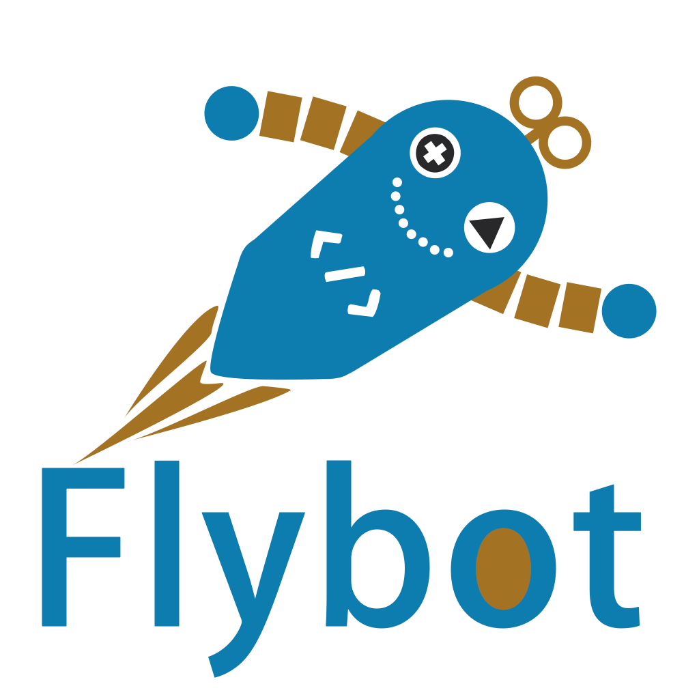

    

    
        
    
    

<h1 align="center">🔸 FLYBOT Web and Mobile App 🔸</h1>

This `mono-repo` hosts a **Clojure(Script)** full-stack web and mobile app.

## 💡 Rational

As a company specialized in Clojure, it made sense for us to have our Blog Website developed with Clojure(Script). We wanted to have a way to highlight what we do, our open-source contributions, our job offers and so on.

Moreover, the second goal of this project was too highlight some of our open-source libraries by [@robertluo](https://github.com/robertluo) that belong to a stack we call `lasagna` as a reference to having separate layers of implementation as opposed to the spaghetti code and architecture we all fear.

This stack is currently composed of 2 libraries:

### 🔗 [fun-map](https://github.com/robertluo/fun-map)

**Fun-Map** is a Clojure library that blurs the line between identity, state, and function, providing a convenient way to perform associative dependency injections, allowing you to manage state and build systems with ease.

### 🔗 [lasagna-pull](https://github.com/flybot-sg/lasagna-pull)

**lasagna-pull** is a Clojure library that provides an intuitive query language for precisely selecting and extracting data from deep and nested data structures, offering features like filtering, parameterization, and even pattern validation using malli schemas.

## 🔸 Features

Employees can use their corporate google account to log in to the website. Once logged in, they can create-edit-delete posts. Some admin users can delete interact with other users'posts. 

They have several optional configurations to customize their posts such as the order of apparition of the post in the page, having an cover image for the post etc

Therefore, logged in users can switch the UI to `edit mode` and create/edit posts. There is a `preview` post feature as well (similar to what you can see on GitHub for instance).

You will find classic website features such as light/dark mode, syntax highlighting in code block and responsive design.

## 🔸 Lasagna Stack

You can learn more about the rational of the lasagna stack libraries in:
- [Fun-Map Rational](docs/lasagna-stack/fun-map.md)
- [Lasagna-Pull Rational](docs/lasagna-stack/lasagna-pull.md)

Also, you can see how these libraries applied to our app in:
- [Fun-Map applied to flybot.sg](docs/lasagna-stack/fun-map-applied-to-flybot.md)
- [Lasagna-Pull applied to flybot.sg](docs/lasagna-stack/lasagna-pull-applied-to-flybot.md) 

## 🖊️ Architecture

Our repo is a `mono-repo` that host the **server**, the **web** client and the **mobile** client.

The server is done in Clojure leveraging:
- **robertluo/fun-map** for associative dependency injections
- **sg.flybot/lasagna-pull** to represent the API as pure Clojure data and fetch only relevant data
- **aleph/aleph** for server
- **metosin/reitit** for routing
- **datalevin/datalevin** for storage

The web client is done in ClojureScript leveraging:
- **reagent/reagent** for React interfacing
- **re-frame/re-frame** for state management
- **com.bhauman/figwheel-main** for development tooling

The mobile client is done in ClojureScript leveraging:
- **io.vouch/reagent-react-native** for React Native
- **re-frame/re-frame** for state management
- **com.bhauman/figwheel-main** for development tooling

To learn more about what our repo contain and how it is organized, consult:
- [Clojure Mono Repo example : server + 2 clients](docs/architecture/mono-repo.md)

## ⏳ Status

✔️ the web app is finished and hosted on AWS

🔨 the mobile app is not finished and was only tested on iOS locally (it is not a priority for us to release it at the moment)

## ▶️ Run the app

In the document [How to run the different systems](docs/development/how-to-run.md), you will find how to:
- Start clj REPL
- Start clj/cljs REPL for web dev
- Start clj/cljs REPL for mobile dev (with Xcode simulator)
- Run clj and cljs tests
- Build the js bundle
- Build an uberjar
- Generate a container image locally or on AWS ECR

## 🛠️ Contributing

If you find any issue and want to contribute, you are welcome to do so!

To do so, create an issue.

The issue title is a **problem** you want to **solve**, for instance:
- *Post edits with no changes are still submitted*
- *Users are not notified on successful actions*

Add the # of the issue at the beginning of your forked branch (i.e. *12-fix-frontend-post-issue*)
